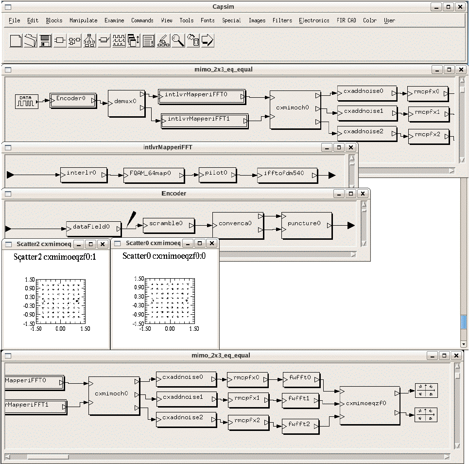
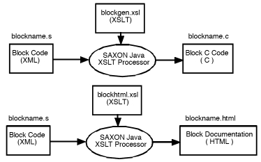

# capsim-tmk
<h1>Capsim&reg;  DSP and Communications System Block Diagram Modeling and Simulation Text Mode Kernel (TMK) </h1>

CAPSIM&reg; Text Mode Kernel (TMK) is a hierarchical interactive block diagram simulation and design system for digital signal processing and communications. All Capsim TMK models are written in C with provisions for parameters, input /output buffers, internal state maintenance, and three phases of execution: initialization, run-time and wrap-up.
Capsim&reg;  Blocks are written in C embedded in XML for modular/re-usable design. Capsim&reg; includes a built in TCL interpreter for support of iterative simulation and design optimization.

Capsim&reg;  TMK has been the basis for advanced research projects and undergraduate and graduate courses in communications and signal processing.
Capsim&reg; TMK based designs have resulted in the rapid introduction of new products into the market. Start your projects with Capsim TMK's built in models and extensive DSP and communications applications. Then easily incorporate your own custom C models into Capsim&reg; TMK . Capsim&reg; TMK is provided with extensive documentation.

Capsim&reg; TMK has built in IIR and FIR filter design blocks. It also incorporates LMS and fast RLS adaptive filters and block LMS adaptive filters. More and more DSP and communication applications will be added to the Capsim&reg; TMK release. Capsim&reg; models end to end OFDM systems with acquistion, timing recovery, and  carrier offset estimation with channel modeling. Capsim&reg; also models MIMO OFDM systems for both closed loop and open loop systems.

Capsim&reg; with its flexible buffer connection management can handle mixed synchronous and asynchronous simulations. One key advantage of Capsim&reg; is that the blocks run at their natural sampling rate using the unique buffer connection architecture.

<h2>Capsim&reg; Blocks </h2>
The new model for block C code generation is illustrated below, Blocks are written in embedded C code in XML and transformed to C code and incorporated into Capsim&reg;. The XML code is transformed using XSLT (Extensible Stylesheet Language for Transformation) to C code and HTML for documentation. Tools are provided that automatically do the conversion from XML to C code when adding models to Capsim&reg;.

<h1>Documentation</h1>   

 <ol type="1">
    <li>Capsim Text Mode User Guide </li>
    <li>Capsim Customization </li>
    <li>Blocks Documentation </li>
<li><a href="https://www.ccdsp.org/IIPPlot/index.html">IIPPlot</a> Interactive Java Plotting Package</li>
<li><a href="https://www.ccdsp.org/DrawTopology/">Java Program to Draw Topologies</a></li>
</ol> 

<h2>Capsim&reg; TMK History</h2>
Capsim&reg; was originaly developed by XCAD Corporation.  All XCAD Open Source projects have been transferred to and taken over by Silicon DSP Corporation. Silicon DSP Corporation has since 2006 added major enhancements to Capsim&reg; and Capsim&reg; TMK. The  predecessor and original model of CAPSIM&reg; was  BLOSIM.  BLOSIM is a block diagram signal processing simulation program, originally developed at the University of California, Berkeley, 1985. The primary authors were D. G. Messerschmitt and D. J. Hait. For papers on BLOSIM visit this link.  Since arrival at NCSU in November 1987, the program has been extensively debugged. Capsim&reg;  was completely remodeled, enhanced with new commands,  and improved by  XCAD Corporation and later by Silicon DSP Corporation. The person-hours spent on this task have made Capsim a vast improvement over the original in user convenience, capability and reliability and the complete elimimation of memory leaks allowing for unlimited simulation runs ( for example for BER in optocal links). 

The latest version changes the block models to full XML support with the capability to transform the C embedded in XML code to C/C++, SystemC, and HTML or stand alone C 
subroutines. A major enhancement has been the integration of TCL scripting capability where TCL scripts control the blocks in a block diagram and can change parameters and retrieve results from the blocks after a simulation completes.

The principal authors for the enhancements to BLOSIM are Professor Sasan Ardalan formerly with the Dept. of Electrical and Computer Engineering, North Carolina State Univertsity, Raleigh, NC and Jim Faber, Ph.D. 
<h2>Capsim&reg; TMK Licensing</h2>
The Capsim&reg; Text Mode Kernel is written in C and along with hundreds of blocks and a subroutine DSP library is licensed under the GNU Lesser General Public License. Tools used to develop blocks including many Perl scripts are covered by the GNU General Public License. These tools are separate from the Capsim&reg; TMK library. The intention is to provide all of the source code of the Capsim&reg; kernel, blocks and subroutine libraries as open source code with freedom to modify and enhance the code. The GNU Lesser General Public License is intended to allow the linking in of blocks developed by the community without having to expose the code for the linked blocks. However, we encourage all developers to publish the code for their blocks and subroutines. All modifications and enhancements to the Kernel, any of the supplied blocks and subroutines with the Capsim&reg;TMK distribution must be published if distributed. Any distribution of the created Capsim&reg; executable must include a statement showing links to the original Capsim&reg;TMK source code.

  <h3>Original IEEE Papers by Messerschmitt on BLOSIM</h3>
    
David G. Messerschmitt, &quot;<a href="Blosim/MesserschmittJSAC.pdf">A Tool for Structured Functional Simulation</a>&quot;, <em>IEEE Journal on Selected Areas in Communications</em>, Vol. SAC-2, NO.1, January 1984, pp.137-147

    
David G. Messerschmitt, &quot;<a href="Blosim/messerschmittBuffers.pdf">Structured Interconnection of Simulation Programs</a>&quot;,1984 <em>IEEE GlobeComm</em>. pp. 808-811 

    

<h2>Capsim&reg;TMK Capability Improvements over Blosim </h2>
      
Many features have been added to improve simulation design and run-time efficiency.

      <ul>
        <li>program re-organization, saving 20% on executable size</li>
        <li>improved scheduling algorithm:Before a simulation is run, blocks are &quot;scheduled&quot; or put into an appropriate order of execution by the controller. The new algorithm selects a more efficient ordering.</li>
        <li>improved run-time control of data buffer size. Previously, certain buffers could grow abnormally large,&nbsp; requiring excessive memory usage. Buffer size is now balanced throughout the topology via an improved visitation algorithm.</li>
        <li>data buffer de-allocation, allowing multiple runs. Previously, multiple runs would overflow available memory.</li>
        <li>internal block (both block and hierarchical block) parameter model storage,&nbsp; specification, and definition. This provides consistency checking and prevents run-time errors. Additionally, the block author now specifies parameter default values and definitions.</li>
        <li>parameter broadcast (via &quot;args&quot;) is possible even from the highest topology level.</li>
        <li>buffer signals can be named. These signal names are accessible by the block operational code,&nbsp; for printing, labeling, etc, and are displayed for reference.</li>
        <li>Argument numbers&nbsp; may be noncontiguous. However, when stored they become contiguous.</li>
        <li>Plugged all memory leaks so that unlimited size simulations can be run with bounded memory foot print.</li>
      </ul>
      
<strong>CAPSIM&reg; Convenience Improvements</strong>

      
Many features have been added or improved to aid the user in creating, editing and running simulations.

      <ul>
        <li>on-line parameter changes with prompting; automatic type checking and compatibility enforcement for hierarchical block referenced parameters (args).</li>
        <li>on-line help descriptions for all commands.</li>
        <li>on-line review of block/hierarchical block source files.</li>
        <li>command history: repeat/review of previous commands.</li>
        <li>command alias mechanism allows shortened commands.</li>
        <li>new movement command &quot;to&quot;: accepts full or partial name for a block  or hierarchical block</li>
        <li>change checking: prevents inadvertent exit or re-loading before saving a modification.</li>
        <li>run a simulation from any location in the topology</li>
        <li>improved information display format:block modification status, parameter descriptions, signal names,/hierarchical block argument values and descriptions.</li>
        <li>improved error reporting: full block path names used; complete messages from block errors.</li>
        <li>simplified block creation: automatic instance name, default parameter creation.</li>
        <li>simplified block connection/disconnection: automatic default port numbering.</li>
        <li>re-loading of any sub-topology is possible.</li>
        <li>Buffer growth monitoring. This facility allows the user to monitor the growth of buffers during simulations. </li>
        <li>new command &quot;replace&quot;: pin-for-pin block substitution.</li>
        <li>Galaxies(Hierarchical Blocks) can be substituted for blocks, etc. Connections are saved, and parameters are modified automatically.</li>
        <li>new command &quot;insert&quot;: put a block into an existing connection.Useful for temporary measurement blocks, etc.</li>
        <li>new command &quot;delete&quot;: remove a block, but restore connections.</li>
        <li>Single command to make buffer numbers contiguous.</li>
        <li>Incorporation of TCL interpreter for iterative simulation support and design optimization</li>
      </ul>
      <h4><strong>CAPSIM Development Improvements </strong></h4>
      <ul><li>Conversion from AWK to PERL and XSLT. </li>
        <li>Changed block code to embedded C in XML</li>
        <li>Using XSLT to transform block XML to C code</li>
        <li>Development and addition of Open Source Tools for Block Code Generation, and Block Database Maintenance.</li>
        <li>Single make command to add new blocks to Capsim&reg; executable. </li>
        <li></li>
      </ul>

